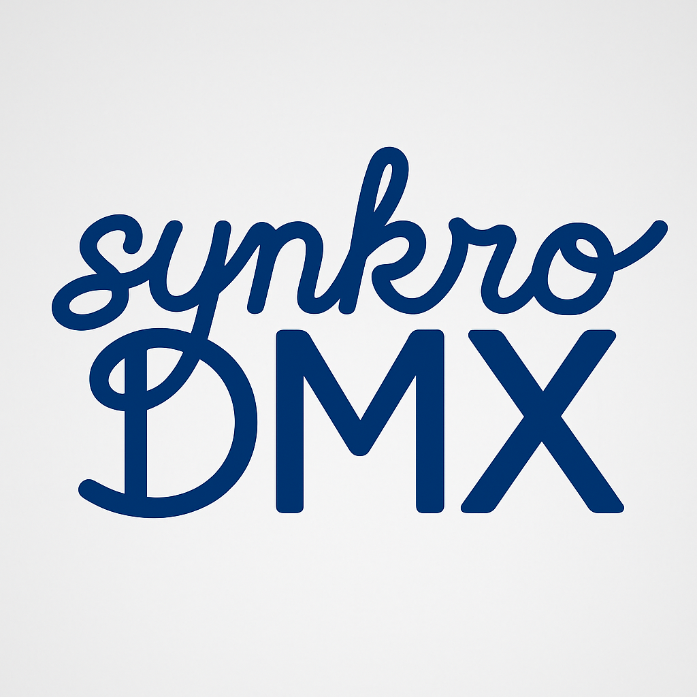

#  SynkroDMX

**Synkro DMX Sync** is a Python-based system for synchronizing DMX-controlled lighting with music played from streaming services such as Spotify.  
It processes musical structure and timing information - derived from MIDI analysis of the upcoming track - and maps it to preconfigured lighting scenes and effects.  
The result is a fully automated, beat-accurate light show that adapts to every section, accent, and transition of a song.

---

## Features

- **MIDI-Based Music Analysis**  
  - Load and parse MIDI files converted from Guitar Pro tabs (e.g., downloaded from Songsterr).  
  - Extract tempo, time signatures, beats, drum hits, and structural sections.  
  - Optional local genre estimation to adapt color palettes and effects.

- **Real-Time Synchronization with Spotify**  
  - Monitor playback state via the Spotify Web API (using [Spotipy](https://spotipy.readthedocs.io/)).  
  - Detect the exact start of the next song and launch the prepared lighting timeline in sync.  
  - Millisecond-level scheduling for accurate cue triggering.

- **Scene and Cue Generation**  
  - Map musical sections (intro, verse, chorus, bridge…) to predefined lighting scenes.  
  - Trigger one-off effects (strobes, color bumps, blackouts) on drum accents or other rhythmic events.  
  - Configurable palettes and effect logic per genre or track.

- **DMX Control via QLC+**  
  - Direct integration with **QLC+ Web API** (WebSocket `ws://127.0.0.1:9999/qlcplusWS`).  
  - Commands to set channels, trigger functions, blackout, or full-on.  
  - QLC+ handles DMX interface output.  

- **Modular & Extensible Architecture**  
  - Separate modules for music analysis, scene generation, DMX output, and playback sync.  
  - Easy to add new lighting devices, scene types, or analysis logic.  
  - Designed for both live performance and offline show precompilation.

---

## Repository Structure

```plaintext
SynkroDMX/
├── README.md                  # Project description and usage
├── notebooks/
│    │    
│    ├── synkrodmx_spotify_import_demo.ipynb
│
├── requirements.txt           # Python dependencies
├── main.py                    # Main CLI entry point
├── src/
│   └── synkrodmx/
│       ├── __init__.py
│       ├── audio/
│       │   ├── midi_loader.py
│       │   ├── sections.py
│       │   ├── spotify_sync.py
│       │   └── tempo_map.py
│       ├── dmx/
│       │   ├── __init__.py 
│       │   ├── dmx_control.py
│       │   ├── qlc_client.py
│       │   └── patch.py
│       ├── guitarpro/
│       │   ├── __init__.py
│       ├── pipeline/
│       │   └── build_show.py
│       ├── scenes/
│       │   ├── __init__.py
│       │   ├── cues.py
│       │   ├── generators.py
│       │   └── scene_manager.py
│       └── spotify/
│           ├── __init__.py
│           ├── album_colors.py
│           ├── auth.py
│           ├── playback.py
│           ├── poller.py
│           ├── schedule.py
│           ├── spotify_integration.py
│           └── types.py
└── tests/
│   ├── __init__.py
│   ├── test_midi.py
│   ├── test_dmx.py
│   ├── test_scenes.py
│   └── test_pipeline.py
├── docs/                      # Documentation
│   ├── architecture.md
│   └── api_reference.md
└── assets/                    # Static files & configuration
    ├── config.yaml
    └── example_scene.json
```

---


## QLC+ Setup

This project requires **[QLC+](https://www.qlcplus.org/)** installed on your system.  
QLC+ must be started with Web access enabled to allow SynkroDMX to control DMX output.

1. **Start QLC+ with Web Access Enabled**

```bash
# Start QLC+ with WebSocket support (default port 9999)
qlcplus -w
```

or, if your system requires specifying the port explicitly:

```bash
qlcplus -w --web 9999
```

2. In QLC+, make sure your DMX interface is active (Input/Output tab → Outputs).  
3. Optional: define functions/scenes in QLC+ to trigger them from SynkroDMX.

---

## Getting Started

1. **Install Dependencies**
   ```bash
   pip install -r requirements.txt
   ```

2. **Test DMX Output**
   ```bash
   python -m synkrodmx.dmx.tools.full_on --universe 1
   # or blackout
   python -m synkrodmx.dmx.tools.blackout --universe 1
   ```

3. **Run the Pipeline**
   ```bash
   python main.py run --track <spotify_track_id> --midi <file.mid>
   ```

4. **Preview Without Lights**
   ```bash
   python main.py dry-run --midi <file.mid>
   ```

---

## License

This project is released under the MIT License.
